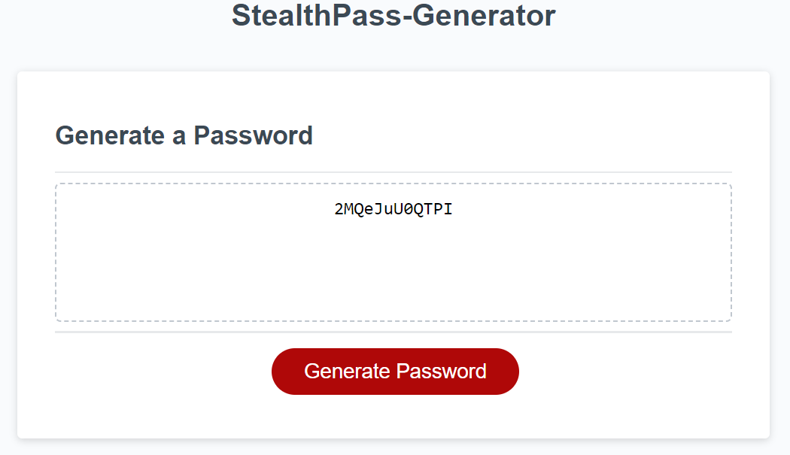

# StealthPass-Generator

## Description

 The application generates a random password based on the criteria the user picks.
 The user interface is clean, polished and responsive, and it adapts to multiple screen sizes.

## Output

The following image and video show the web application's appearance and functionality:

https://github.com/HIYASHE06/StealthPass-Generator/assets/152214043/6183fb37-4ff7-42b2-9c71-1b4871c06961
**DEPLOYED WEBSITE LINK**https://hiyashe06.github.io/StealthPass-Generator/
## How to Use

A series of prompts are present for the password criteria

* Length of password.
* At least 8 characters but no more than 128.
* Character types
* Lowercase
* Uppercase
* Numeric
* Special characters ($@%*, etc)
* Code validates for each input and at least one character type should be selected
* A password is generated when the button is clicked

## License

MIT License

Copyright (c) 2023 Nkosinathi Prince Hiyashe.

Permission is hereby granted, free of charge, to any person obtaining a copy of this software and associated documentation files (the "Software"), to deal in the Software without restriction, including without limitation the rights to use, copy, modify, merge, publish, distribute, sublicense, and/or sell copies of the Software, and to permit persons to whom the Software is furnished to do so, subject to the following conditions:

The above copyright notice and this permission notice shall be included in all copies or substantial portions of the Software.

THE SOFTWARE IS PROVIDED "AS IS", WITHOUT WARRANTY OF ANY KIND, EXPRESS OR IMPLIED, INCLUDING BUT NOT LIMITED TO THE WARRANTIES OF MERCHANTABILITY, FITNESS FOR A PARTICULAR PURPOSE AND NONINFRINGEMENT. IN NO EVENT SHALL THE AUTHORS OR COPYRIGHT HOLDERS BE LIABLE FOR ANY CLAIM, DAMAGES OR OTHER LIABILITY, WHETHER IN AN ACTION OF CONTRACT, TORT OR OTHERWISE, ARISING FROM, OUT OF OR IN CONNECTION WITH THE SOFTWARE OR THE USE OR OTHER DEALINGS IN THE SOFTWARE.
